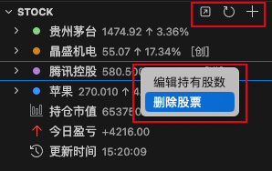

## 股票看盘工具

在侧边栏中展示自选股涨跌情况，每隔3秒自动刷新，示例如下：

## 使用方式

1、常规方式：在`VS Code Settings`中配置自选股代码，示例如下：

2、快捷方式：（1）右键菜单支持编辑与删除 （2）顶部菜单支持新增与刷新

## 问题反馈

如果有任何问题或建议，请通过以下方式联系我：

- Email: [coderwsh@gmail.com](mailto:coderwsh@gmail.com)
- WeChat: `Cy6er_Kin9`